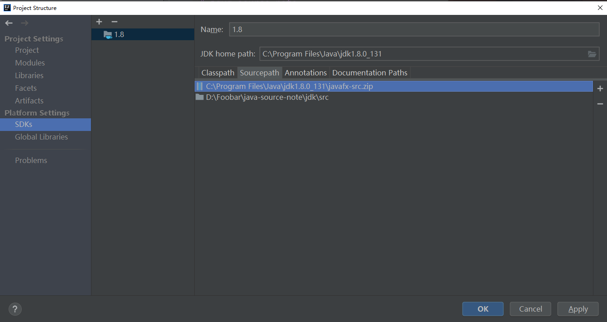

# Java source

Java8源码阅读笔记，源码阅读笔记直接记录在[源码](../jdk/src)上。

- [ArrayList](#ArrayList)
- [LinkedList](#LinkedList)
- [HashMap](#HashMap)
- [TreeMap](#TreeMap)


## 1 准备
* 设置IDEA源码路径，IDEA-> File -> Project Structure -> SDKs -> Sourcepath
* 删除原来的`src`，新增`jdk/src`  



## 2 总结

### 2.1 集合
1 集合只存放**引用类型**的元素

2 不推荐使用的集合 - by 廖雪峰老师

由于Java的集合设计非常久远，中间经历过大规模改进，我们要注意到有一小部分集合类是遗留类，不应该继续使用：
* Hashtable：一种线程安全的Map实现；
* Vector：一种线程安全的List实现；
* Stack：基于Vector实现的LIFO的栈。
* 还有一小部分接口是遗留接口，也不应该继续使用：Enumeration<E>：已被Iterator<E>取代。

3 List
> 有童鞋可能觉得使用Iterator访问List的代码比使用索引更复杂。但是，要记住，通过Iterator遍历List永远是最高效的方式。并且，由于Iterator遍历是如此常用，所以，Java的for each循环本身就可以帮我们使用Iterator遍历。
by 廖雪峰老师

### 2.2 ArrayList
1. 本质上是对数组的封装，数组的偏移和复制用的是{@link System#arraycopy}(C++实现)
2. 实现了Iterable，采用迭代器模式
3. 数组的可见内容，其实是依靠单独维护了一个 size 变量表示实际的数据大小。在添加和删除的时候，需要对数组进行偏移
4. 线程不安全的，只有在共享的时候才会存在线程安全问题
5. 通过modCount实现快速失败机制(fail-fast)
6. 自动扩容的时候，有两种方式：一种是扩容为1.5倍，另一种是有一个期望值。最后两个比较得到一个最大的

### 2.3 LinkedList
1. 双向链表，有头节点和尾节点，插入和删除需要注意链表为空的情况
2. 线程不安全
3. 迭代器遍历，因为AbstractList里的迭代器只是从头到尾的遍历，而LinkedList是双向链表，因为要实现ListIterator
4. 查询的时候，其实进行了一次二分，提高了效率。至于为什么不能划分多次，当然是因为只能从头节点开始，或者尾节点开始

### 2.4 HashMap
### 2.4.1 位运算符号知识补充
* ^ 异或 俗称的半加法
* 左移右移 
    * 左移：相当于 乘 2的n次幂，例如：`1 << 4  = 1 2^4`
    * 右移：相当于 除以2的n次幂，例如：`32 >> 3 = 32 / (2^3)`
* 交换两个数：
```
  a=a^b
  b=a^b
  a=a^b
  
  a=a+b
  b=a-b
  a=a-b
```
* 判断奇偶： `(0 == (a & 1)`
* 当length是2的幂时，`hash % length = hash & (length-1)`
* 当一个数是2的次方时，`二进制只有一个是1，其他是0`

#### 2.4.2 总结
1. HashMap 底层的数据结构主要是：数组 + 链表 + 红黑树。涉及到红黑树的内容比较难懂，插入、查找、扩容时如果遇到红黑树都够喝一壶了
    * 其中当 (链表的长度 >= 8 && 数组大小 >= 64) 时，链表会转化成红黑树
    * 当红黑树的大小 <= 6 时，红黑树会转化成链表
2. threshold = capacity * load factor
3. TREEIFY_THRESHOLD = 8的设计思想，是基于Poisson distribution，理论上来说几乎不会出现链表长度为8，因为概率很小
4. capacity数组容量必须是2的次方(幂)，记住：**222222222222222222222**
5. hash % length = hash & (length-1)(当length是2的次方时)。因为位运算 & 比 % 的效率高，所以HashMap要求容量必须是2的次方，不过本质还是取模%
6. hash 和 key的关系。答：hash值是通过hash(key)计算出来的，而下标的位置是通过hash & (length-1)计算得出来的，下标并不是key的值，也不是hash的值，而是hash & (length-1)
7. 源码有些地方格式不友好，比如 {@link HashMap#putVal}中，在if语句中去初始化值。好在变量命名友好，能够知其意
8. 扩容。如果旧的容量不为空，如果超过了最大容量，则threshold = Integer.MAX_VALUE；否则扩容为2倍(因为capacity必须是2的次方)。为0表示第一次初始化，使用默认值
9. 线程不安全，可以用{@link ConcurrentHashMap}采用迭代器模式，使用modCount++实现fail-fast
10. JDK1.7链表插入时用的是头插法，1.8是尾插法
    * 如果是头插法，会改变链表的上的顺序。在并发时，扩容时会造成环形链或数据丢失
    * 如果是尾插法，在扩容时会保持链表元素原本的顺序，不会出现链表成环的问题。在并发时，可能会覆盖数据

### 2.4.3 设计思想

**Q: TREEIFY_THRESHOLD = 8的设计思想**

A: 因为链表查询的时间复杂度是O(n)，红黑树的查询复杂度是O (log (n))。在链表数据不多时，遍历也很快。
只有当链表数据较多时，才会转换为红黑树。<b>但红黑树占用的空间比链表大</b>

泊松分布概率函数：
> 泊松概率分布描述的是在某段时间或某个空间内发生 随机事件次数 的 概率

8是根据泊松分布概率结果得出的，当是8时，概率为：0.00000006。
因此，正常来说几乎不会遇到链表长度为8的情况，除非hash算法太垃圾了。
```text
Ignoring variance, the expected
     * occurrences of list size k are (exp(-0.5) * pow(0.5, k) /
     * factorial(k)). The first values are:
     *
     * 0:    0.60653066
     * 1:    0.30326533
     * 2:    0.07581633
     * 3:    0.01263606
     * 4:    0.00157952
     * 5:    0.00015795
     * 6:    0.00001316
     * 7:    0.00000094
     * 8:    0.00000006
     * more: less than 1 in ten million
```


**Q: 为什么当length是2的幂时，`hash % length = hash & (length-1)`**

A: 首先这也是为什么HashMap的容量必须是2的次方设计原因。因为**如果一个数是2的次方。二进制只有一个是1，其他是0**。当`(length-1)`时，得到的刚好是**除了最高位的外的数**，
此时利用`&`的特性，再和一个数进行`&`操作，就相当于取模`%`了。示例：
```
例如：
32 00000000 00000000 00000000 ‭00100000‬
31 00000000 00000000 00000000 ‭00011111

hash 未知数
hash&31  00000000 00000000 00000000 ‭000?????
```

**Q: tableSizeFor设计思想**

A: 见下面代码注释
```java
    /**
     * Returns a power of two size for the given target capacity.
     *
     * @return 返回一个2的次方数，因为数组容量必须是2的次方，并且 >= cap的
     * 例如: cap = 14，返回16
     *      cap = 16，返回16
     *      cap = 17，返回32
     *
     * 设计思想：
     *           14     ‭00010100‬
     *      n >>> 1     ‭00001010
     *
     * n |= n >>> 1     ‭00011110
     *      n >>> 2     ‭00000111
     *
     * n |= n >>> 2     ‭00011111
     *      n >>> 4     ‭00000000
     *
     * n |= n >>> 4     ‭00011111
     *
     * ...
     *
     * n+1              ‭00100000
     *
     */
    static final int tableSizeFor(int cap) {
        // -1，是因为返回的是>=cap的，当cap本身就是2的次方数时，-1就能保证得到的是>=cap的
        int n = cap - 1;
        // 以下>>>操作是为了将`有效的0`变成`1`。`1+2+4+8+16=31` 因为int是8个字节，32位，保证了所有`有效的0`都可以变成`1`
        n |= n >>> 1;
        n |= n >>> 2;
        n |= n >>> 4;
        n |= n >>> 8;
        n |= n >>> 16;
        // 最后n+1，是因为如果一个数是2的次方。二进制只有一个是1，其他是0。我们上面的操作就是为了变成`‭00011111`这种形式
        // n+1理解，是因为+1之后就进位了，变成`‭00100000`这种形式。思想可以参考问题`hash % length = hash & (length-1)`
        return (n < 0) ? 1 : (n >= MAXIMUM_CAPACITY) ? MAXIMUM_CAPACITY : n + 1;
    }
```

**Q: hash设计思想**

A: 见下面代码注释
```java
    static final int hash(Object key) {
        int h;
        // 1. key为null则hash是0，所以要注意put的key是null的情况
        // 2. (h = key.hashCode()) ^ (h >>> 16)对hash结果再处理，增加散列
        // 3. 为了防止不同hashCode的高位不同但低位相同导致的hash冲突，把高位的特征和低位的特征组合起来，降低哈希冲突的概率
        // 4. h >>> 16是因为hashCode是int类型，32位。(h >>> 16)右移16，再通过^操作则使高位和低位对hash影响更平均
        // 5. 为什么是用^。从4中我们可以学到，异或^，因为是半加法，使得两个指^后能更散列
        return (key == null) ? 0 : (h = key.hashCode()) ^ (h >>> 16);
    }
```

### 2.5 TreeMap
1. HashMap的key是无序的，而TreeMap则是有序树
2. 通过 compare 来比较 key 的大小，然后利用红黑树左小右大的特性，为每个 key 找到自己的位置，从而维护了 key 的大小排序顺序
## 参考
- [Java教程 - 廖雪峰](https://www.liaoxuefeng.com/wiki/1252599548343744)
- [java源码分析](https://github.com/stalary/Source-code-analysis)
- [面试官系统精讲Java源码及大厂真题](https://github.com/luanqiu/java8)
- [一篇文章深入理解JDK8 HashMap](https://itlemon.blog.csdn.net/article/details/104271481)
