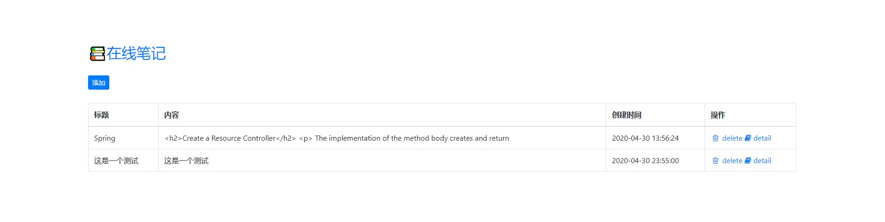
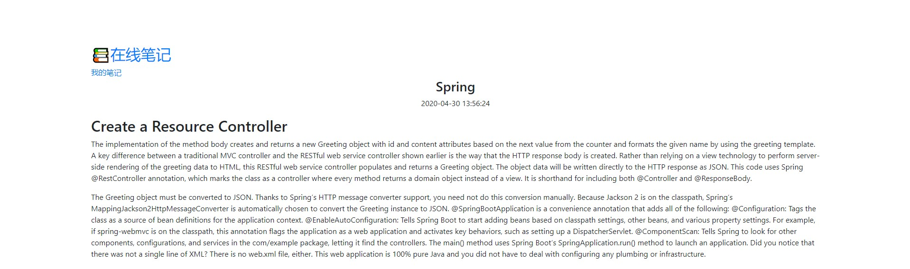

# python3-web-flask-note
基于Flask的Python3 Web入门编程笔记

主要探索以下几个内容：
1. Python Flask前后端是如何交互的
2. 请求路由，如何返回json数据，跳转到指定html界面
3. 表单提交，如果是用vue的话，这里
4. sql操作，使用SQLAlchemy如何进行CRUD
5. ORM，对象关系映射
6. http，request，response，cookie，session，context

在这里只是简单的研究Python Flask如何实现一个简单的Web系统，只实现了简单的增删查。中间遇到了几个不友好的问题：
* obj转json
* 数据库层操作的便利性

另外，Flask用的是jinja2模板引擎，如果你使用vue，需要解决语法冲突

## 预览





## 环境
* python3.7

## 工具
* PyCharm 2020.1 (Professional Edition)
* Postman

## 说明
数据库执行脚本
```text
sql_script
```
安装依赖
```text
pip install -r requirements.txt
```
单独安装
```text
pip install -i https://pypi.tuna.tsinghua.edu.cn/simple some-package
```
更新pip
```text
python -m pip install --upgrade pip
```
**error: Microsoft Visual C++ 14.0 is required. Get it with "Microsoft Visual C++ Build Tools"**

解决方案：
```
1. mysqlclient‑1.4.6‑cp37‑cp37m‑win32.whl
地址：https://www.lfd.uci.edu/~gohlke/pythonlibs/#mysqlclient
cp37为对应的python版本，然后下载适合自己的版本，我这里下载的是win32位的

2.安装
pip install mysqlclient‑1.4.6‑cp37‑cp37m‑win32.whl

```

## 文档和示例
[python入门 + PythonWeb-Flask](doc/README.md)

[示例程序](demo)

## 实战
在线笔记系统，见`app.py`
